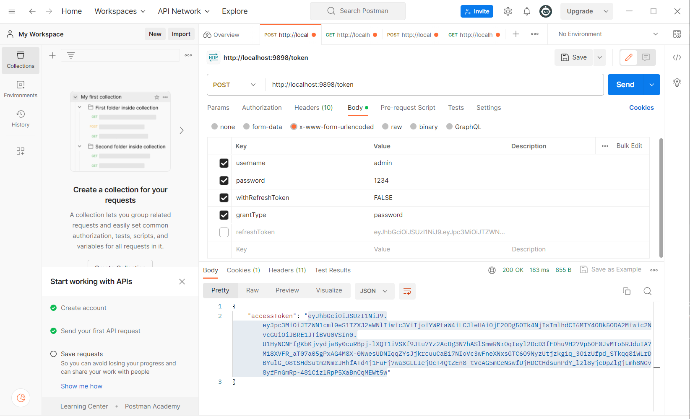
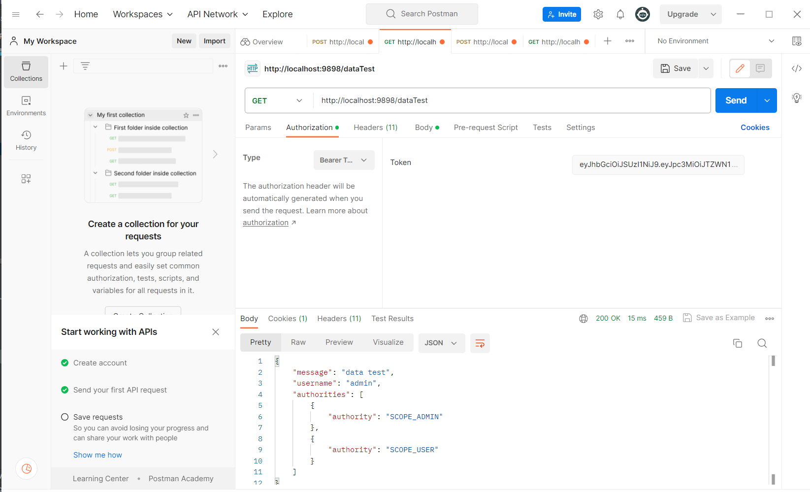
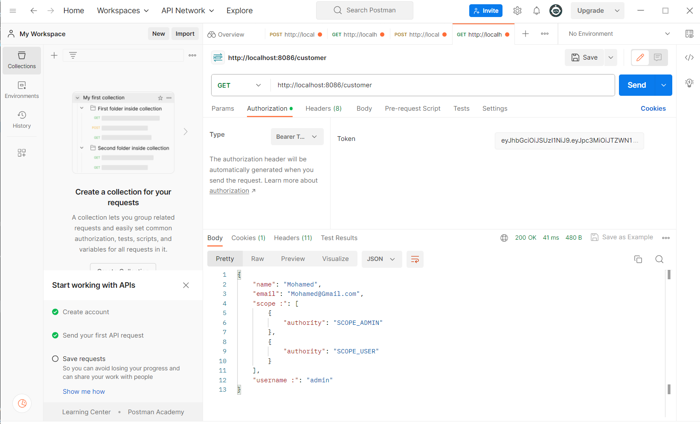

<H1  style="text-align:center"> Using Spring Security In Microservices </H1>
<H3>- Get Admin Access Token</H3>

<H3>- Access To Methods Using Bearer Token  </H3>

<H3>- Using Spring Security To Get Access To Customer Service  </H3>
